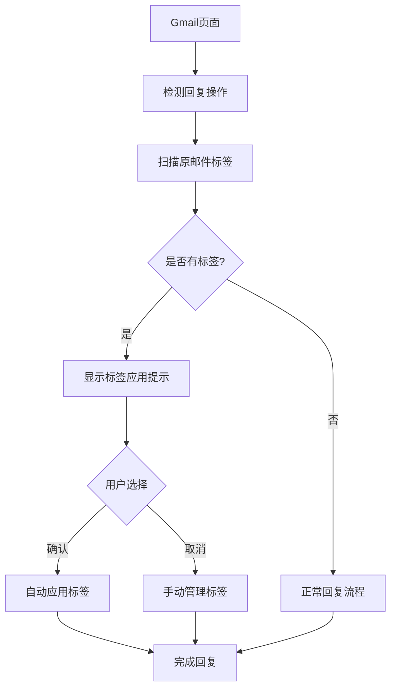

# Gmail标签管理器Chrome扩展 - 产品需求文档

## 1. Product Overview
Gmail标签管理器是一个Chrome扩展，旨在提升Gmail用户的标签管理体验。当用户回复已打标签的邮件时，扩展会自动将相同标签应用到回复邮件中，同时支持用户自定义标签显示顺序和名称。
- 解决Gmail原生标签管理功能不够智能和灵活的问题，提高邮件分类效率
- 目标用户是频繁使用Gmail标签功能的商务人士和个人用户

## 2. Core Features

### 2.1 User Roles
由于这是一个浏览器扩展，所有用户具有相同的权限，无需区分角色。

### 2.2 Feature Module
我们的Gmail标签管理器扩展包含以下主要功能模块：
1. **扩展设置页面**: 扩展配置选项、标签自定义设置
2. **Gmail集成界面**: 标签顺序调整、自动标签提示
3. **标签管理面板**: 标签重命名、显示设置

### 2.3 Page Details

| Page Name | Module Name | Feature description |
|-----------|-------------|---------------------|
| 扩展设置页面 | 基础配置 | 启用/禁用自动标签功能，设置提示方式（自动应用或手动确认） |
| 扩展设置页面 | 标签自定义 | 为Gmail标签设置自定义显示名称，不影响服务器端真实标签名 |
| Gmail集成界面 | 标签顺序调整 | 在Gmail边栏中拖拽调整标签显示顺序，保存用户偏好设置 |
| Gmail集成界面 | 自动标签检测 | 检测回复邮件的原邮件标签，自动应用或提示用户添加相同标签 |
| 标签管理面板 | 标签重命名 | 批量管理标签的自定义显示名称，支持搜索和筛选 |
| 标签管理面板 | 显示设置 | 控制标签在Gmail界面中的显示方式和优先级 |

## 3. Core Process

**主要用户操作流程：**

1. **扩展安装和配置流程**：用户安装扩展 → 打开Gmail → 访问扩展设置 → 配置自动标签选项
2. **标签自定义流程**：用户在标签管理面板 → 选择要重命名的标签 → 设置自定义显示名称 → 保存设置
3. **自动标签应用流程**：用户点击回复邮件 → 扩展检测原邮件标签 → 自动应用标签或显示提示 → 用户确认或调整
4. **标签顺序调整流程**：用户在Gmail边栏 → 拖拽标签到目标位置 → 扩展保存新顺序 → 刷新后保持设置

## 4. User Interface Design

### 4.1 Design Style
- **主色调**: Gmail蓝色 (#1a73e8) 作为主色，浅灰色 (#f8f9fa) 作为背景色
- **按钮样式**: 圆角按钮，与Gmail原生设计保持一致
- **字体**: 使用系统默认字体，主要文字14px，辅助文字12px
- **布局风格**: 简洁的卡片式布局，与Gmail界面无缝集成
- **图标样式**: 使用Material Design图标，保持与Gmail一致的视觉风格

### 4.2 Page Design Overview

| Page Name | Module Name | UI Elements |
|-----------|-------------|-------------|
| 扩展设置页面 | 基础配置 | 开关按钮、下拉选择框，白色背景卡片，蓝色强调色 |
| 扩展设置页面 | 标签自定义 | 输入框、保存按钮，列表展示，支持搜索筛选 |
| Gmail集成界面 | 标签顺序调整 | 拖拽手柄、标签卡片，半透明遮罩提示拖拽状态 |
| Gmail集成界面 | 自动标签提示 | 浮动提示框、确认/取消按钮，位于撰写邮件区域上方 |
| 标签管理面板 | 标签重命名 | 表格布局、内联编辑、批量操作按钮 |
| 标签管理面板 | 显示设置 | 复选框、滑块控件，分组显示不同类型设置 |

### 4.3 Responsiveness
扩展主要针对桌面端Gmail使用，采用桌面优先设计。考虑到Gmail的响应式特性，扩展界面会适配不同屏幕尺寸，但不专门优化触摸交互。