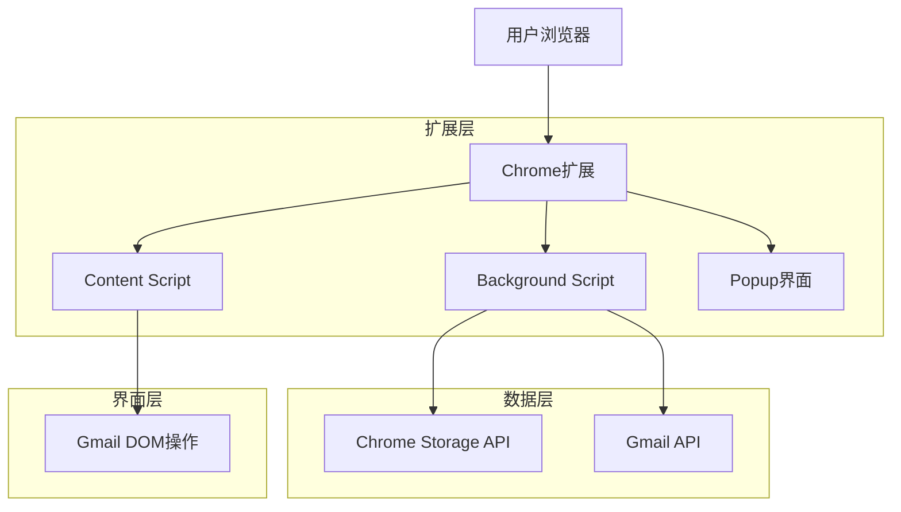
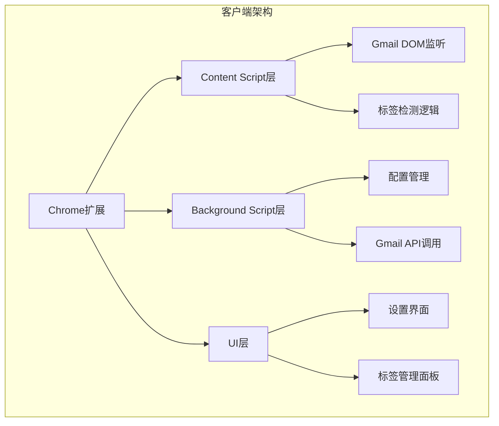
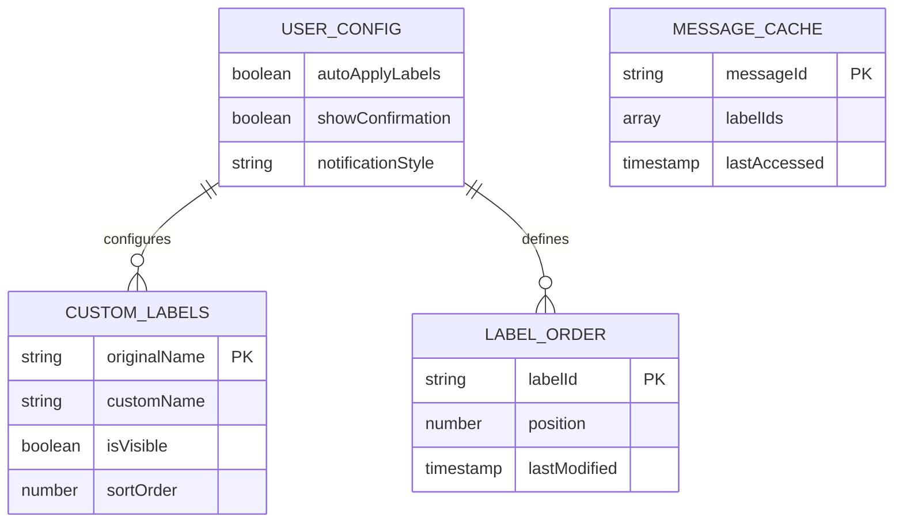

# Gmail标签管理器Chrome扩展 - 技术架构文档

## 1. Architecture design



## 2. Technology Description

* **前端**: Vanilla JavaScript + Chrome Extension APIs + HTML/CSS

* **存储**: Chrome Storage API (本地存储用户配置)

* **Gmail集成**: Gmail API + DOM操作

* **构建工具**: Webpack + Babel (可选，用于代码打包和兼容性)

## 3. Route definitions

| Route         | Purpose                |
| ------------- | ---------------------- |
| popup.html    | 扩展弹窗页面，提供快速设置和状态查看     |
| options.html  | 扩展选项页面，详细配置和标签管理       |
| content.js    | 注入Gmail页面的内容脚本，实现DOM操作 |
| background.js | 后台脚本，处理扩展生命周期和API调用    |

## 4. API definitions

### 4.1 Chrome Extension APIs

**存储配置**

```javascript
// 保存用户配置
chrome.storage.sync.set({
  autoApplyLabels: boolean,
  customLabelNames: object,
  labelOrder: array
})
```

**Gmail API集成**

```javascript
// 获取邮件标签
gapi.client.gmail.users.messages.get({
  userId: 'me',
  id: messageId
})
```

### 4.2 内部API设计

**标签管理**

```javascript
// 获取自定义标签名称
function getCustomLabelName(originalName: string): string

// 保存标签顺序
function saveLabelOrder(labelIds: string[]): void

// 检测邮件标签
function detectMessageLabels(messageElement: HTMLElement): string[]
```

**DOM操作**

```javascript
// 注入标签拖拽功能
function enableLabelDragAndDrop(): void

// 显示自动标签提示
function showLabelSuggestion(labels: string[]): void
```

## 5. Server architecture diagram

由于这是一个纯客户端Chrome扩展，不需要服务器架构。所有功能都在浏览器端实现：



## 6. Data model

### 6.1 Data model definition



### 6.2 Data Definition Language

**Chrome Storage数据结构**

```javascript
// 用户配置存储
const userConfig = {
  autoApplyLabels: true,
  showConfirmation: false,
  notificationStyle: 'popup', // 'popup' | 'inline' | 'none'
  enableDragAndDrop: true
};

// 自定义标签名称存储
const customLabels = {
  'Label_1': {
    originalName: 'Work',
    customName: '工作',
    isVisible: true,
    sortOrder: 1
  },
  'Label_2': {
    originalName: 'Personal',
    customName: '个人',
    isVisible: true,
    sortOrder: 2
  }
};

// 标签顺序存储
const labelOrder = {
  orderedLabelIds: ['Label_1', 'Label_2', 'Label_3'],
  lastModified: Date.now()
};

// 邮件标签缓存（临时存储，提高性能）
const messageCache = {
  'message_123': {
    labelIds: ['Label_1', 'Label_2'],
    lastAccessed: Date.now()
  }
};

// 初始化存储数据
chrome.storage.sync.set({
  userConfig: userConfig,
  customLabels: customLabels,
  labelOrder: labelOrder
});

// 本地缓存（不同步）
chrome.storage.local.set({
  messageCache: messageCache
});
```

**扩展清单文件 (manifest.json)**

```json
{
  "manifest_version": 3,
  "name": "Gmail Label Manager",
  "version": "1.0.0",
  "description": "智能Gmail标签管理器，支持自动标签继承和自定义排序",
  "permissions": [
    "storage",
    "activeTab"
  ],
  "host_permissions": [
    "https://mail.google.com/*"
  ],
  "content_scripts": [{
    "matches": ["https://mail.google.com/*"],
    "js": ["content.js"],
    "css": ["styles.css"]
  }],
  "background": {
    "service_worker": "background.js"
  },
  "action": {
    "default_popup": "popup.html",
    "default_title": "Gmail Label Manager"
  },
  "options_page": "options.html"
}
```

